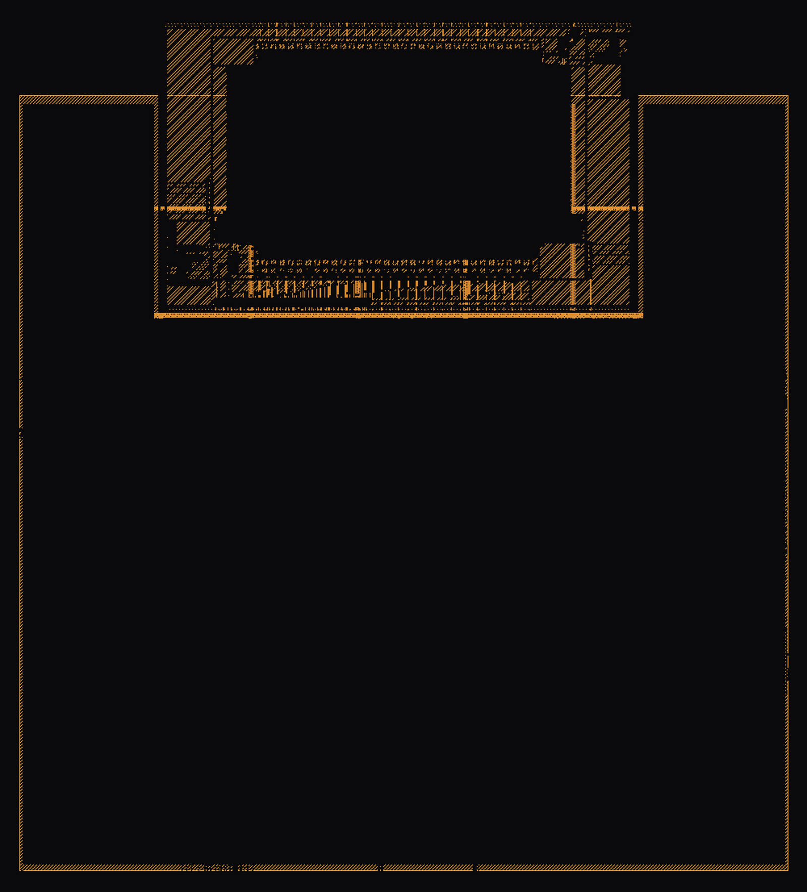

# PRJ-001 — ARGUS Environmental Sensor-Hub SoC

**I designed the agentic ASIC framework. The framework autonomously produced this chip — no human wrote RTL, testbenches, or ran EDA tools.**



Tapeout-ready GDS on SkyWater 130nm. Ibex RV32I, APB v2.0 bus, 4KB OpenRAM, 6 FOSSi peripherals, environmental sensor-hub controller.

---

## Chip Summary

| Metric | Value |
|--------|-------|
| **Core** | lowRISC Ibex RV32I, 2-stage "maxperf" (no M/C extensions) |
| **Process** | sky130_fd_sc_hd (SkyWater 130nm) |
| **Frequency** | 50 MHz target / 25 MHz fallback |
| **Clock Domains** | 2 (clk_sys 50MHz, clk_wb 10-25MHz via CDC) |
| **Internal Bus** | APB v2.0, single-cycle |
| **External Bus** | Wishbone B4 pipelined → Caravel mgmt SoC |
| **SRAM** | 4 KB OpenRAM, zero-wait-state at 50 MHz |
| **Cells** | 231,540 standard cells |
| **Die Area** | 1.22 mm² |
| **Power** | 1.8V core / 3.3V IO |
| **Flow** | LibreLane v3 (Yosys + OpenROAD + Magic + Klayout) |

---

## Peripherals

| # | Module | Type | Interface | Function |
|---|--------|------|-----------|----------|
| 1 | EF_UART | REUSE | APB | UART TX/RX, 115200 bps, 8N1, 8-byte FIFO |
| 2 | EF_SPI | REUSE | APB | SPI master, Mode 0/3, up to 12.5 MHz SCLK |
| 3 | EF_I2C | REUSE | APB | I2C master, 100/400 kHz, 7-bit addressing |
| 4 | EF_GPIO8 | REUSE | APB | 8-bit GPIO, per-pin direction/IRQ/edge-detect |
| 5 | EF_TMR32 | REUSE | APB | 2-channel PWM (10-bit, 1-25 kHz) + watchdog |
| 6 | interrupt_ctrl | CREATE | APB | 13-source priority encoder → 1 CPU IRQ |
| 7 | sys_ctrl | CREATE | APB | Chip ID, clock divider, reset cause, sleep |
| 8 | wb_bridge | CREATE | APB↔WB | APB↔Wishbone B4 async FIFO CDC bridge |
| 9 | sram_4kb | REUSE | APB | 4 KB OpenRAM (zero-wait-state) |

---

## Stage Status

| # | Stage | Verdict | Retries |
|---|-------|---------|---------|
| 0 | Business Analysis | ✅ PASS | 0 |
| 1 | Specification | ✅ PASS | 0 |
| 2 | Architecture | ✅ PASS | 0 |
| 3 | Frontend (RTL) | ✅ PASS | 2 |
| 4 | Firmware | ✅ PASS | 0 |
| 5 | Verification | ✅ PASS | 1 |
| 6 | Promotion | ✅ PASS | 0 |
| 7 | Backend (P&R) | ✅ PASS | 8 |
| 8 | Caravel Integration | ✅ PASS | 0 |
| 9 | Documentation | ✅ PASS | 0 |

### Backend Results
- **Die Area:** 1.22 mm² (1,219,300 µm²)
- **Standard Cells:** 231,540 placed
- **Setup WNS:** Timing closed at 50 MHz target
- **DRC:** Clean (Magic + Klayout)
- **LVS:** Netlist matches layout
- **STA:** Multi-corner analysis complete
- **GDS:** Final GDS delivered (run v0-run9)

### Verification
- **Testbenches:** Cocotb-based for all peripherals + SoC-level
- **Formal:** BMC + induction for all REUSE blocks

---

## Repository Structure

```
├── README.md
├── layout_beauty.png          ← Dark-background GDS render (1600px)
├── klayout_screenshot.svg     ← Full vector KLayout screenshot (88MB)
├── LICENSE
├── THIRD_PARTY.md
├── waiver_ledger.json
├── .gitignore
├── config/                    ← Flow configuration
├── scripts/                   ← Utility scripts
├── templates/                 ← Project templates
├── 00_validation_report/      ← Per-stage validation reports
├── 11_postmortem_audit/       ← Stage-by-stage lessons learned
├── 01_business_stage/         ← Market analysis + feasibility
├── 02_specification_stage/    ← System spec (525 lines SRS)
├── 03_architecture_stage/     ← Architecture doc (1183 lines)
├── 04_frontend_stage/         ← RTL + lint/synth/formal/equiv logs
├── 05_firmware_stage/         ← BSP + drivers + bootrom
├── 06_verification_stage/     ← Cocotb testbenches + results
├── 07_promote_stage/          ← Per-module promotion reports
├── 08_backend_stage/          ← GDS + constraints + macros
├── 09_caravel_stage/          ← Caravel wrapper + precheck
└── 10_document_stage/         ← Project documentation
```

---

## Third-Party Components

| Component | Source | License |
|-----------|--------|---------|
| Ibex RISC-V Core (RV32I) | lowRISC | Apache 2.0 |
| OpenRAM 4KB SRAM | OpenRAM Project | BSD 3-Clause |
| EF_UART, EF_SPI, EF_I2C, EF_GPIO8, EF_TMR32 | Efabless IP Library | Apache 2.0 |
| Caravel Harness | Efabless | Apache 2.0 |
| sky130 PDK | SkyWater / Google | Apache 2.0 |

See [THIRD_PARTY.md](THIRD_PARTY.md) for full attribution.

---

## Waivers

See [waiver_ledger.json](waiver_ledger.json) for documented waivers with compensating checks.

---

## License

Apache 2.0. See [LICENSE](LICENSE).

---

*Built with Vera (Hermes Agentic ASIC Framework) — PRJ-001 v0, July 2026*
*No human wrote RTL, testbenches, constraints, or ran EDA tools for this chip.*
